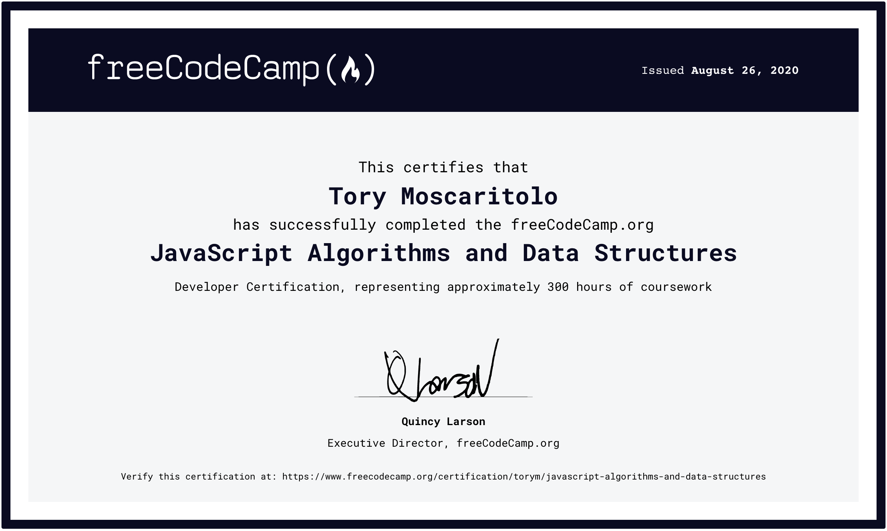

# 100 Days Of Code - Log
### Outline for my 100 Days of Code Challenge:
I am using this challenge in an effort to train positive studying habits and to help make my self more accountable in my studies. The challenge will also help me in my efforts start some small projects that I can apply what I've learnt to real world projects.

**My Plan**:
* I will spend a minimum of 1 hour a day learning more about JavaScript and Front End Libraries through FCC's online courses, as well as other resources.
* I will try apply my new knowledge by creating some small projects.
* I aim to have a minimum of 3 small projects completed by the end of the challenge.
* I also aim to complete some or all of the JavaScript challenge projects I found from the JavaScript30 website (Dependent on how my personal projects go).
* Total Days: 111

<!-- 
Project Ideas:
- Small JS web games: Tic Tac Toe, Text based game?
- Website -> Heisenburgers

<!--
### Day x: October 1, 2020
**Today's Progress**:

**Thoughts**:

**Link(s) to Work**:

**Time**:
-->

### Day 69: October 8, 2020
**Today's Progress**: Worked on more React, & tried learning more Vim interactions.

**Thoughts**: Vim's cool, going to take a while to remember all the important keys and to use them quickly. React's interesting, and kind of confusing with so how 'this' is used so often and in different ways.

**Time**: 3 hours

### Day 68: October 7, 2020
**Today's Progress**: More React.

**Time**: 2 hour

### Day 67: October 6, 2020
**Today's Progress**: Worked through more React.

**Time**: 3 hours

### Day 66: October 5, 2020
**Today's Progress**: Worked through more React.

**Thoughts**: Worked through more React questions, haven't really had much time this long weekend to work each day unfortunately. Will be able to make up for it this week + days added to total.

**Time**: 1 hour

### Day 62: October 1, 2020
**Today's Progress**: Work some more through React.

**Time**: 90 minutes

### Day 61: September 30, 2020
**Today's Progress**: Worked on an Algorithm question, related to a friends project & did some more React.

**Thoughts**: I hadn't done much in the way of JS algorithms for a while now, was good to give it a go again.

**Link(s) to Work**: [Array Length Question](challenges/arrLength.js)

**Time**: 3 hours

### Day 60: September 29, 2020
**Today's Progress**: Helped a friend with some frontend work on their personal project.

**Thoughts**: First time really giving it a go working on a relatively large project, was quite confusing at first, as it was primarily in Ruby, but I was being asked to try fix some of the frontend side of things.

**Time**: 2 hours

### Day 59: September 28, 2020
**Today's Progress**: Working through more React lessons, and tried out vim in VS Code.

**Time**: 2 hours

### Day 57: September 26, 2020
**Today's Progress**: Worked through some more React/JSX lessons.

**Thoughts**: Interested to see how I can implement it myself in a project, but it mostly seems as something that is more beneficial with larger projects.

**Time**: 1 hour

### Day 56: September 25, 2020
**Today's Progress**: Began the React lessons in the Frontend Course.

**Thoughts**: I've done some React through Codecademy, but I had to stop because I hadn't learnt enough JS, HTML or just enough in general, so it was more confusing than helpful. But this time round it's much easier to understand.

**Time**: 2 hours

### Day 55: September 24, 2020
**Today's Progress**: Finished off the Sass lessons.

**Thoughts**: Sass seems interesting and very useful once I start working with larger CSS files, and it's useful that it works very similarly to JavaScript with @while, @for etc.

**Time**: 2 hours

### Day 54: September 23, 2020
**Today's Progress**: Worked through some of FCC's Sass section of the Frontend Development Course.

**Thoughts**: Finished up my resume, and finally started to apply at some companies, so we shall see how that goes. Also worked through some lessons on Sass.

**Time**: 3 hours

### Day 53: September 22, 2020
**Today's Progress**: I've begun applying for jobs as of today. I also updated my NASA Image Tool [Deep Space Curiosity](https://github.com/tory24/deepSpaceCuriosity).

**Thoughts**: Nervous, because obviously I haven't done a computer science degree. But I guess I'll test the waters and hope for the best. Ideally, I want a role where I'll be supported and can learn and grow by interacting & working alongside more experienced and knowledgeable Engineers. Regardless I still need to study and learn as much as I can and I think I've made some good progress in these last 8 or 9 months.

For the Image Tool, I decided that trying to implement particle effects myself is just way above my ability, and unnecessary when there's already a free tool out there ready to use. I had trouble integrating it initially, but once I got it working, it turned out really nice & exactly as I wanted.

**Link(s) to Work**: [Deep Space Curiosity](https://github.com/tory24/deepSpaceCuriosity)

**Time**: 3 hours~

### Day 52: September 21, 2020
**Today's Progress**: Essentially completed the NASA Random Image API.

**Thoughts**: Was enjoyable, I managed to figure out how to draw data from the API using NASA's API Documentation as well as some trial and error. I also wrote the async await function myself and got it working with the HTML doc. Then started fixing up some page issues, like centering the image & adding a box to the image description.
Tomorrow I'll try fix up a couple more things, but otherwise I'm super happy with how it turned out.

**Link(s) to Work**: [Deep Space Curiosity](https://github.com/tory24/deepSpaceCuriosity)

**Time**: 5 hours

### Day 51: September 20, 2020
**Today's Progress**: Worked a bit more on the page design.

**Thoughts**: Finding it hard to get a lot done on weekends, but plan on working on getting the API to work tomorrow, then build from there.

**Time**: 1 hour

### Day 50: September 19, 2020
**Today's Progress**: Started building the page.

**Thoughts**: Started making a basic webpage, to get a basic look first, and also I didn't have much time to get into it today, being a Saturday. Also got to use a bit of Bootstrap.

**Time**: 1 hour

### Day 49: September 18, 2020
**Today's Progress**: Started to plan out an app that puts out a random image from NASA's Image & Video Library.

**Thoughts**: Basically I want to use this to test out some basic Bootstrap or jQuery to build a simple webpage that puts out a random image while also learning how to use an API. However this time I plan on doing it completely by myself.

**Time**: 2 hours

### Day 48: September 17, 2020
**Today's Progress**: Finished the jQuery course, started Sass.

**Thoughts**: Enjoyed learning jQuery, seems very handy, I'm excited to give it a go soon, maybe add it to some existing small projects to see if I can improve them. Started the intro to Sass, but I think I want to quickly try out Bootstrap and jQuery on something first, maybe tomorrow.

**Time**: 3-4 hours

### Day 47: September 16, 2020
**Today's Progress**: Started the jQuery section of this FCC course.

**Thoughts**: While this course seems a little bare bones compared to the JS course, it's made me far more confident in understanding these essential frameworks and libraries.

**Time**: 1 hour

### Day 46: September 15, 2020
**Today's Progress**: Worked some more on FreeCodeCamp, went through the Bootstrap Course.

**Thoughts**: Really interesting, makes CSS far simpler in my opinion, and helps reduce some of the quirks from aligning/designing items through CSS, but it does seem to make HTML look a bit more messy.

**Time**: 3 hours

### Day 45: September 14, 2020
**Today's Progress**: Read some articles, and looked into how backend works with storing data.

**Thoughts**: I think this was a bit more than I could understand currently, but I am determined to understand how storing and retrieving data works in more depth eventually. Also quickly figured out how to run JS files through Terminal, something that I have been meaning to look into for a while. Turns out it's super straightforward.

**Time**:1.5 hours

### Day 44: September 13, 2020
**Today's Progress**: Worked on Codecademy again, reviewed Modules again.

**Thoughts**: Nothing too exciting, just some more revision today.

**Time**: 1 hour

### Day 43: September 12, 2020
**Today's Progress**: Had a quick look into how to implement a HTTP Request Limiter.

**Thoughts**: A lot of confusing info, but I'm looking to try see if I can implement it into my weatherapp, something basic but hopefully it'll help me better understand how it works/how to implement a system.

**Time**: 1hr

### Day 42: September 11, 2020
**Today's Progress**: Continued studying, moved onto Modules refresher.

**Thoughts**: I'm aiming to use these few days of refresher lesson to apply to a project. Just need to think of an appropriate project.

**Time**: 1hour

### Day 41: September 10, 2020
**Today's Progress**: Decided to do some revision on Classes through Codecademy.

**Thoughts**: Went back through the lessons on Coddecademy, was much easier this time around, though I had forgotten some smaller details. Planning on trying to finish the Codecademy course as it covers some important information about Async-await & Promises and how they tie into front-end web development. These lessons I attempted doing early on in my studies but felt I had little idea about what I was learning.

**Time**: 2 hours.

### Day 40: September 9, 2020
**Today's Progress**: Worked on Codecademy some more, recreating a simplified version of the Lodash library.

**Thoughts**: This was originally a challenge I gave up on when I first started learning, purely because I just hadn't learnt enough, and it scared me. However coming back, while it seemed foreign, it was actually fairly simple. The prebuilt tests that the program provided didn't make sense to me when I originally attempted this, however this time through I understood how to actually use them to help me find the solution without resorting to the youtube explanation they provide.

**Link(s) to Work**: [Lodash Library](challenges/simple-lodash.js): This is just the code I wrote.

**Time**: 4 hours

### Day 39: September 8, 2020
**Today's Progress**: Worked on understanding how to resolve issues on Github.

**Thoughts**: I think I understand how issues work, however the challenge I was given by a friend, I wasn't sure how to complete. I am planning on coming back to this in a few days.

**Time**: 2 hours

### Day 38: September 7, 2020
**Today's Progress**: Completed the FCC Symmetric Difference Question. Worked on changing my weatherapp JS from a Promise to an Async Await function.

**Thoughts**: Symmetric Difference Question: Was confused by how to find the result, but realised my error and came up with the correct solution much faster than my old one. For the WeatherApp I decided to change the fetch method, and turn it into an Async-await function, I'm quite happy with how it works, am feeling more and more confident in my abilities. My next goal is to try create something a little more interesting without much assistance.

**Link(s) to Work**: [Q1 Symmetric Difference](challenges/interview-qs.js), [WeatherApp](https://github.com/tory24/weatherapi)

**Time**: 4hours

### Day 37: September 6, 2020
**Today's Progress**: Worked on an FCC Interview challenge question.

**Thoughts**: Was quite difficult as it seemed easy at first, like the pallindrome question. I got very close to finding the solution, just need to remove the repeated elements from the array.

**Link(s) to Work**: [Q1 Symmetric Difference](challenges/interview-qs.js) 

**Time**: 1.5 hours

### Day 35: September 4, 2020
**Today's Progress**: Worked on the Weather App again.

**Thoughts**: Decided I would tinker with the existing JS today, altered it to show only the 2 most recent searches. Helped me to learn a little bit more about how the JS/HTML/CSS connection works, as I had to use a few new HTML DOM Methods. I think I'll move on and try build something new, and hopefully come back to this one day able to build the JS section by myself.

**Link(s) to Work**: [WeatherApp](https://github.com/tory24/weatherapi) 

**Time**: 3 hours

### Day 34: September 3, 2020
**Today's Progress**: Worked on building my Weather API App.

**Thoughts**: Had the HTML & CSS pretty much set with the Weather App, however I ended up copying the JavaScript from the app I was trying to emulate [George M. Weather App](https://webdesign.tutsplus.com/tutorials/build-a-simple-weather-app-with-vanilla-javascript--cms-33893). I realised my knowledge of fetch and APIs in general is too basic to have done it myself. However, I read through the JavaScript adding comments to it as I tried understanding what each line was trying to do, as a result I think I have a better understanding of what needs to be done, and will try make a slightly more basic version tomorrow, without help.

**Link(s) to Work**: [WeatherApp](https://github.com/tory24/weatherapi) 

**Time**: 4 hours

### Day 33: September 1, 2020
**Today's Progress**: Finished a simple webpage counter, and started a simple Weather app.

**Thoughts**: The webpage counter was super simple, and I wanted to keep it simple and just focus on making it work. Didn't take long at all. But after I decided to finally try and figure out how to implement a Weather API key in a weather app. My plan is to use vanilla js, html and css. So far I've been able to mostly do it by myself, however I will have to teach myself how to actually draw data from the api key. I will be working on that tomorrow.

**Link(s) to Work**: [Counter](https://github.com/tory24/counter) [WeatherApp](https://github.com/tory24/weatherapi) 

**Time**: 4 hours

### Day 32: August 31, 2020
**Today's Progress**: Finished a small project, listed on my github - [Colour Flipper](https://github.com/tory24/Colour-Flipper). Also working to finalise my resume today.

**Thoughts**: The Colour Flipper was fun and not too difficult to complete, was nice to see I haven't forgotten much CSS or HTML, and am able to use everything together to make a simple project.

**Link(s) to Work**: [Colour Flipper](https://github.com/tory24/Colour-Flipper)

**Time**: 2hrs

### Day 31: August 28, 2020
**Today's Progress**: Worked on a suggested mini project, a colour flipper webpage.

**Thoughts**: Decided to try do a small project, which I found online. Goal is to create a basic webpage where you click a button and the background colour of the page changes to a new colour, and that colour's RGB values also show on the page. 

**Time**: 2hours

### Day 30: August 27, 2020
**Today's Progress**: Worked on learning how to contribute to Github repositories, and started thinking of any small projects I could do, and also what I will be learning next.

**Thoughts**:

**Link(s) to Work**:

**Time**: 90min~

### Day 29: August 26, 2020
**Today's Progress**: Finished the FCC JavaScript Algorithms & Data Structures course.

**Thoughts**: The final question was really tough, took me a couple days but was able to come up with a solution without much help. I also learnt that Floating Point values do not work accurately in certain cases, something that had somehow never come up before as a potential limitation of programming. The workaround is Math.round((x + y)*100)/100. Not pretty, but it works.

**Link(s) to Work**: [Q5 Phone](challenges/alg&datastruc-projects.js)

**Time**: 4-5 Hours

### Day 28: August 25, 2020
**Today's Progress**: Worked on a coding interview style question from a friend, check to see if a string is an anagram or not. Also tried working on the register question again, but will have to finish it tomorrow.

**Thoughts**: The anagram question was quite easy, finished it fully within an hour. Was able to get it to check against a single string, but also return a new array of all anagrams of the 'str1' in a longer string 'book'. Also made it able to ignore punctuation, like commas, or apostrophes. Am not sure of how to make it work in languages other than English though.

**Time**: 4 hours

### Day 27: August 24, 2020
**Today's Progress**: Almost finished FCC.

**Thoughts**: Worked through the last few questions, again, its very cool to see that I'm way more comfortable to just tackle a question that I never thought I could have answered only a few months or weeks ago. Stuck on the final question of the course, having a hard time resolving some issues with the solution, will come back tomorrow and hopefully with a better solution.

**Link(s) to Work**: [Q4 Phone](challenges/alg&datastruc-projects.js)

**Time**: 4 hours +

### Day 24: August 21, 2020
**Today's Progress**: Worked on the final few questions of the FCC Course

**Thoughts**: Completed the Roman Numerals question I got stuck on yesterday, happy with my answer, not sure if it's a fast method or not, but was able to eventually find a solution without Google.

**Link(s) to Work**: [Q2 & Q3 Roman Numerals](challenges/alg&datastruc-projects.js)

**Time**: 100min

### Day 23: August 20, 2020
**Today's Progress**: Finished Intermediate Alogrithms on FCC.

**Thoughts**: Finally finished the Int Algorithms section in the FCC course. Can definitely notice an improvement in how I am able to answer/tackle each question vs the beginning of the section.

**Link(s) to Work**: [Q15-Q17](challenges/intAlgorithms.js) & [Q1 Palindrome](challenges/alg&datastruc-projects.js)

**Time**: 200min

### Day 22: August 19, 2020
**Today's Progress**: Spent time working on my resume. Also questions in FCC Course.

**Thoughts**: Still working on the resume, it's a little daunting trying to figure out what to put in, what's important, what isn't.
            Was pretty darn happy with myself for how I found essentially the best solution to Q14, got it pretty much exactly correct, except I used !! when it wasn't necessary, as it provided no added benefit. Got very stuck with a questions using a function with two parentheses -> function(x)(y).

**Link(s) to Work**: [Q14](challenges/intAlgorithms.js)

**Time**: 100min

### Day 21: August 18, 2020
**Today's Progress**: Completed a few more questions.

**Thoughts**: I got a little stuck on Q13 the other day, and coming back to it, I was able to find a solution fairly quickly. This section is taking far longer than I expected to work through, but I feel like I am learning a little bit more every day.

**Link(s) to Work**: [Q13](challenges/intAlgorithms.js)

**Time**: 120min

### Day 20: August 17, 2020
**Today's Progress**: Worked on my website project. Decided on a more detailed format, and used a navbar link to a lower point in the page.

**Thoughts**: Is still a lot of fun trying to figure out how design my own website, focusing on using CSS grid, but having to understand how the design reacts to new elements, as I am adding to the HTML doc as I go. Probably not the best way to do this, but it's at least testing my knowledge and also helping me apply some of what I've learnt.

**Time**: 120min

### Day 19: August 16, 2020
**Today's Progress**: Worked on my website project.

**Thoughts**: Been a busy couple of days, but got through a bit of my website project, and tried doing the algorithm's but felt like doing some work on the website instead to break things up.
 
**Time**: 40min

### Day 18: August 15, 2020
**Today's Progress**: Had a very busy start to the weekend, so only managed 40 minutes, will make up the time tomorrow.

**Thoughts**: Trying to figure out how to flatten a nested array without using flat() or flatMap().

**Time**: 40min

### Day 17: August 14, 2020
**Today's Progress**: Worked through some more questions, feeling more confident about how to tackle these algorithm questions.

**Thoughts**: Had probably my most satisfying day of coding so far. I know I'm only doing small little questions...but I spent about half an hour to an hour yesterday and then another 40 minutes today trying to figure out why my code wasn't working. After essentailly breaking down the code and logging each part to see what I was doing wrong, I eventually realised my issue, and my code worked as expected.
I do know though, that my solution isn't very efficient, and would probably be quite slow with a larger range of numbers.

**Link(s) to Work**: [Q11](challenges/intAlgorithms.js)

**Time**:

### Day 16: August 13, 2020
**Today's Progress**: Worked through a few questions, got stuck about halfway through the final question, will finish tomorrow.

**Thoughts**: Having to visualise some questions by writing down the problem on paper to figure out the answer. Reminds me of math classes in school and uni, but has massively helped me to better decide what method or callback function I can use find the solution.

**Link(s) to Work**: [Intermediate Algorithms](challenges/intAlgorithms.js)

**Time**: 80min

### Day 15: August 12, 2020
**Today's Progress**: Worked through quite a few questions, involving lots of callback functions, methods & loops. 

**Thoughts**: Was a super productive day, worked through a few questions referring to MDN & Stack Overflow, but a lot less than I had to the last few days. Was pretty happy with my answer for Q7, and learnt about the 'Set' object which essentially filters out repeated array elements as it creates a new array. I've started to find that these questions are starting to become easier to break down and tackle, as I can more easily identify what needs to be done & how I can do that. And I put this purely down to practice, it's nice to see some progress in terms of knowledge and not just seeing the course bar fill.

**Link(s) to Work**: [Intermediate Algorithms](challenges/intAlgorithms.js)

**Time**: 180min

### Day 14: August 11, 2020
**Today's Progress**: Slow day, but managed to get through 3 questions.

**Thoughts**: Managed to finish 2 on my own, however the missing letters question required some additional knowledge -> So through google I learnt how to convert from characters to ASCII and back. Which was just enough to help me connect the dots and figure the rest of the answer, despite it being a bit bulky vs the suggested answer.

**Link(s) to Work**: [Intermediate Algorithms](challenges/intAlgorithms.js)

**Time**: 90min

### Day 13: August 10, 2020
**Today's Progress**: Completed some more questions from the Intermediate Algorithm course.

**Thoughts**: Felt much more confident in what I was doing, after a few tougher days that rocked my confidence a little. Managed to complete a relatively easy question (Search & Replace) and reduce it from the original and bloated 20 lines, down to a final 4 lines including comments.

**Link(s) to Work**: [Intermediate Algorithms](challenges/intAlgorithms.js)

**Time**: 120min~

### Day 12: August 9, 2020
**Today's Progress**: Completed some more Int Algorithm Questions.

**Thoughts**: I decided that it is near impossible to answer some of these questions without resorting to using Google. So I decided that since Google is a useful tool in the real world I will also use Google, however I am making sure to only use blogs that do not reference the FCC question I am working on. I am also making sure that I understand exactly what my code is doing, and not just copy/paste. Also managed a question without any help.

**Link(s) to Work**: [Intermediate Algorithms](challenges/intAlgorithms.js)

**Time**: 60min~

### Day 10: August 7, 2020
**Today's Progress**: Spent time helping explain git and some JavaScript topics to a friend who is also learning. Also spent time trying to figure out a FCC question.

**Thoughts**: Was tough getting through the question, I am resorting to searching google, which feels like cheating. But I know that google is a programmer's best friend, so it's very much a last resort while I'm learning.

**Time**: 80min

### Day 9: August 6, 2020
**Today's Progress**: Worked on a personal project, trying to create a simple website using vanilla HTML, CSS & JS.

**Thoughts**: I really enjoy working on a project like this, it's frustrating but in a fun and challenging way. Feels like I'm trying to problem solve constantly, to figure out how best to design my webpage so that the elements work together. Project is currently in a private repo, hopefully I'll be happy with it soon and make it public!

**Time**: 200min

### Day 8: August 5, 2020
**Today's Progress**: Today was tough, this question was difficult, did not make it 60minutes, will make up for that tomorrow.

**Thoughts**: Was unable to complete Q3 by myself, ended up looking at the result to try understand how to answer the question. The challenge required an understanding of 'arguments' which I had not learnt about, or understood how to use correctly after seeing the answer. A bit of a disappointing day.

**Time**: 40min

### Day 7: August 4, 2020
**Today's Progress**: Began the Intermediate Algorithm Scripting topic, questions are quite tough.

**Thoughts**: The first question was a little challenging but i worked through it quite quickly. The second question seemed easy, something I'm sure I've done before, but took me close to an hour to figure out. While messy, I was able to come to a solution myself. I tried for a bit longer to think of a more concise solution, but was unable to improve on the original. After seeing the solution, I am kicking myself for forgetting about _.includes_.

**Link(s) to Work**: [Day 7 Questions](challenges/day7_challenges.js)

**Time**: 120min

### Day 6: August 3, 2020
**Today's Progress**: Completed the Functional Programming! Beginning the Intermediate Alogrithm Scripting topic tomorrow, I'm hoping to see some real progress in terms of how I can use what I've learnt so far to come up with concise solutions to difficult problems.

Learnt about Currying: Basically it helps with DRY coding, you separate arguments into nested functions with only one argument. It reduces the need to enter the same arguments everytime, when for example only one argument changes.

**Thoughts**: Another day of approaching challenges and being able to not let it overwhelm me, something I initially had trouble with when I started to learn how to code. My notes are becoming quite handy finally. Also learnt that regex can be used with various methods.
Learnt that .split() does not mutate the original string.

**Link(s) to Work**: [Split with Regex Question](challenges/split_regex.js)

**Time**: 120min~

### Day 5: August 2, 2020
**Today's Progress**: Completed some more method based challenges, involving .filter(), .map() and .reduce(). My answer was almost exactly the shortest answer possible.
Will have to add 30minutes to tomorrow.

**Thoughts**: Feeling more confident at tackling small challenges that FCC throw at me, something that I just could not do at the start of this and the Codecademy course. Need to research how the sort method works behind the scenes.

**Link(s) to Work**: [Square Numbers Question](challenges/squareNum.js)

**Time**: 30min

### Day 4: August 1, 2020
**Today's Progress**: Worked through some more questions, found the map & fitler easy to understand, but had issues with syntax. Broke the answer into 2 separate questions to locate the bug, and joined the two answers to solve the question.

**Thoughts**: While it wasn't the shortest answer possible, I was able to break down the question, sort out any bugs and piece it all together. I realised staying motivated over weekend will be difficult.

**Link(s) to Work**: [Map & Filter Question](challenges/map&filter.js)

**Time**: 70min

### Day 3: July 31, 2020
**Today's Progress**: Worked through half of the Functional Programming lessons. Managed to figure out how to answer the challenge that stumped me yesterday, which required adding or removing parts of a global array, without actually mutating the original array. 

**Thoughts**: Slowly learning how to stay patient and stick with it. Also have to remember how important it is to really think outside the box (as lame as that sounds). For example, the challenge from yesterday, while I managed to find an answer, each function was able to be done in just a single line of code. I find I can over-complicate my answers, hopefully with experience I'll start to learn how to be more concise.

**Time**: 60min

### Day 2: July 30, 2020
**Today's Progress**: Completed the final few lessons in OOP, moved on to Functional Programming. Getting very close to completing the JS Certification, only 3 topics remaining.

**Thoughts**: FCC covered a bit on Objects in earlier lessons, but has focused heavily on inheritance and mixins. The functional programming topic so far seems very logical in teaching how to maintain manageable code and how to avoid simple bugs that can have major effects on the program, by following the core principles of functional programming.

Also came across this today: console.log(!![] + !![]); //Output: 2
- My understanding (after some googling), we're converting an empty array (truthy) to false then back to true through a double negative, so essentially it's true + true. The '+' sign converts true to 1, and false would be treated as 0.

**Time**: 120min~

### Day 1: July 29, 2020
**My Progress so far**: I've decided to begin the challenge today, but will be mostly continuing with my current study path.

So far it has been around 5 months since I began studying JavaScript on Codecademy, in that time I have also completed basic courses covering HTML and CSS, Git & SQL. I have been studying pretty regularly, trying to stick to a Monday-Friday routine, however have found it difficult to keep myself accountable, and so I have been prone to skipping a few days at a time. 

In terms of what I am currently doing, I am currently working through FreeCodeCamp's 'JavaScript Algorithm's & Data Structures Certification'.

So far I have worked through:
* Basic JavaScript
* ES6
* Regular Expressoions
* Debugging
* Basic Data Structures
* Basic Algorithm Structures

I am currently halfway through the 'Object Oriented Programming' section of the course.

**Today's Progress**: I worked through a few lessons on Object Oriented Programming, trying to understand how Prototypes work, and how to inheritance works between objects.

**Thoughts**: I have so far found the majority of the FCC course very straight-forward and easy to understand thanks to everything I learnt on Codecademy. However it has helped reinforce my knowledge of core topics, methods and functions as well as filling out some gaps in knowledge that Codecademy did not cover in its JS course.

**Time Spent Learning**: 90min

### Day 0: July 28, 2020
**Today's Progress**: Learning how to use and update this forked repo. Also quickly learning markdown file syntax.

**Thoughts**: Already have some understand of git and github, but still learning exactly how my actions affect github repos. Hopefully this will provide some positive habits and this is not something I usually do (essentially blogging), so it is all new and slightly out of my comfort zone. Also trying to decide whether I should put my most recent day at the top or bottom...

## Markdown Key:
### Headers:
- '#': This is a '< h1>' Tag.
...
- '######': This is a '< h6>' Tag.

### Emphasis:
Note: Must not have spaces.
'* This will be italic *'
'_ As will this _'
'** This will be bold **'
'__ As will this __'
